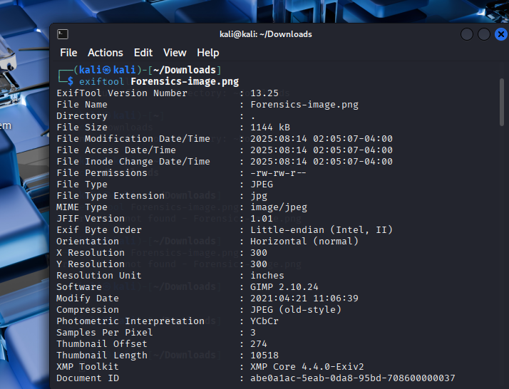

# ExifTool Metadata Analysis Report

## 🔎 Image Overview
- **Filename:** Forensics-image.png
- **File Size:** 1144 kB
- **File Type:** JPEG
- **MIME Type:** image/jpeg
- **Image Dimensions:** 1439x753
- **Megapixels:** 1.1 MP

## 📸 Camera Info
- **Make:** Not specified
- **Model:** Not specified

## 🌍 Geolocation 
- **GPS Lat/Long:** Not available
- **Maps Link:** N/A

## 🕐 Timestamps
- **DateTimeOriginal:** 2021:03:05 05:59:37+01:00
- **ModifyDate:** 2021:04:21 11:06:39

## 📝 Software/Comments
- **Editing Software:** GIMP 2.10.24, Adobe Premiere Pro 2020.0 (Windows)
- **Comment Field:** Not present

## 🔐 SHA256 Hash
- ```
  efecb358e1ade19d08acf1126b846971982fb8b3a82f67bdf7401a8972fd241a

## 🧠 Inference
The image metadata reveals multiple editing events using **Adobe Premiere Pro 2020.0** and **GIMP 2.10.24**.  
It also contains references to multiple ingredient files (videos, PNG images) and no original camera EXIF data (no Make, Model, or GPS coordinates).  
This strongly suggests that the image was **not captured directly from a camera** and has undergone **significant manipulation**.  
**Conclusion:** The image is not original; it has been edited multiple times.

## 🖼️ Screenshots
Below are embedded terminal outputs for both `exiftool` and `sha256sum` commands.  
Highlighted sections:  




